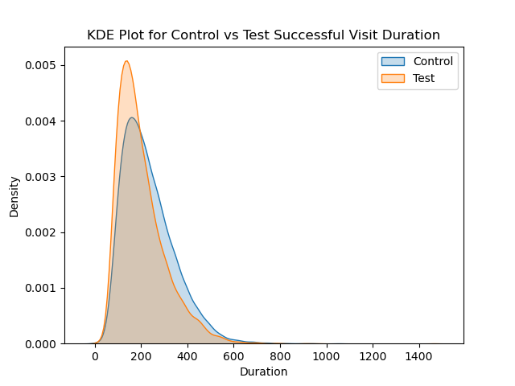

# wk5_to_6_project

This project is an A/B testing analysis aimed at comparing the performance of a new UI and process vs Control groups based on user behavior, demographics, and engagement metrics. The analysis evaluates whether key metrics differ significantly between the two groups using statistical tests and visualization techniques.

## Project Overview

The primary objectives of this project are:
- **Understand user behavior**: Analyse user engagement and success rates in Test and Control groups.
- **Evaluate demographic patterns**: Investigate differences in user demographics (e.g., age, gender, and client tenure) across variations.
- **Statistical significance testing**: Determine whether observed differences are statistically significant using chi-square and t-tests.
- **Visualize data distributions**: Present key insights through KDE plots and summary statistics.

### Key Questions Addressed
1. Is there a significant improvement in success rates (>5%) between Test and Control groups?
2. Is the experiment appropriate to make a conclusion?
3. Was the new process quicker than the old process?

## Data Description

The dataset consists of four primary files:
- **Client Data**: Demographic information (e.g., age, tenure, balance).
- **Visit Data**: 2 files with details of user visits, including success rates and engagement metrics by step.
- **Experiment Data**: Mapping between client IDs and test/control group assignments.

## Analysis Workflow

1. **Loading and Cleaning Data**
   - Merge the client, visit, and analysis datasets.
   - Handle duplicate columns and rename for clarity.
   - Remove missing values and outliers where necessary for statistical tests.

2. **Exploratory Data Analysis (EDA)**
   - Summarized distributions of key variables like balance and tenure.
   - Identified potential outliers using the IQR method.

3. **Statistical Tests**
   - **Chi-square tests**: Assessed independence between categorical variables like gender and success rates across variations.
   - **T-tests**: Compared numerical metrics (e.g. step count, balance, visit duration, etc.) between Test and Control groups.

4. **Visualization**
   - Used Tableau to produce charts and dashboards visualising the findings
   - Generated KDE plots to compare distributions of numerical variables such as balance, age, and tenure.
   - Plotted filtered distributions after removing outliers for better interpretability.
   - Produced a presentation containing the results

## Key Findings

- **Test and Control grouos**: Test and Control groups based on chi-square results were statistically similar by account and client demographic.
- **Success Rates**: Significant association between Variation (Test/Control) and successful visits.
- **Metric Comparisons**: Test metrics, like `step_count` and `visit_duration`, showed statistically significant differences.
- **Results**: Overall, the success rate increased by 2.9%, although far higher by step and just focusing on confirmations.
- The duration of a successful visit was 13% quicker for the Test group.

## Statistical Methods Used

### Chi-square Test
- Hypothesis:
  - **H0**: There is no association between the two categorical variables.
  - **H1**: There is an association between the two categorical variables.

### Independent T-Test
- Hypothesis:
  - **H0**: Mean values of the metric are the same for Test and Control groups.
  - **H1**: Mean values of the metric differ between Test and Control groups.
- Assumes unequal variances between groups (`equal_var=False`).

### Outlier Removal
- Applied the IQR method to filter outliers for numerical columns, ensuring more robust statistical analysis.

## Visualization Samples
Most of the visualisations are in the Tableau file: tableau\Vanguard_Dashboard.twb
KDE plots were generated for key variables to visualize differences between Test and Control groups. Examples include:

- **Age Distribution**:
  
  
  
- **Balance Distribution (Filtered)**:
  
  
  
- **Client Tenure Distribution**:
  
  

- **Visit Duration Distribution**:
  
 

## Requirements

To run the analysis, ensure you have the following Python libraries installed:
- `pandas`
- `numpy`
- `seaborn`
- `matplotlib`
- `scipy`

## Usage

1. Clone the repository:
   ```bash
   git clone https://github.com/your-username/your-repository.git
